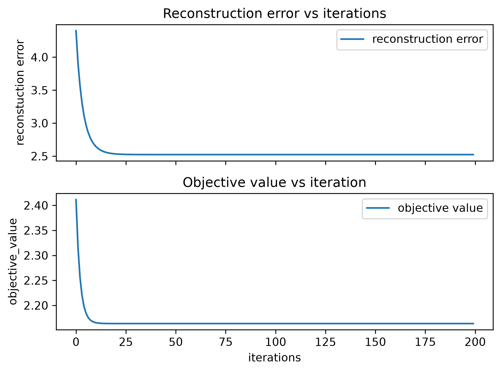
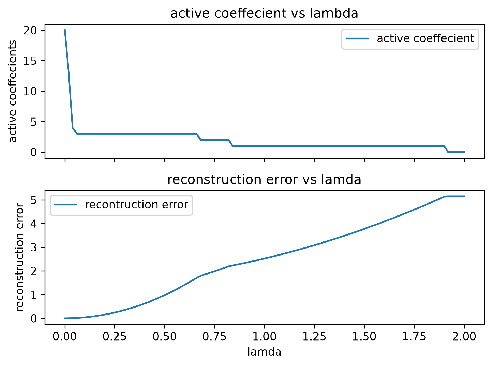

# Sparse Coding with ISTA

This project implements the **Iterative Shrinkage-Thresholding Algorithm (ISTA)** from scratch and uses it to study sparse coding on synthetic data.

The main goal is to understand how ISTA behaves, how the regularization parameter `lambda` controls sparsity, and how sparse recovery changes as the optimization settings change.

## What This Project Does

The project explores:

- ISTA convergence over repeated iterations
- The effect of `lambda` on sparsity
- The trade-off between sparsity and reconstruction error
- Support recovery
- Coefficient recovery
- Comparison of the true and estimated sparse-coding objective values

---

## Sparse Coding Model

Sparse coding represents a signal using a small number of atoms from a larger dictionary.

The basic model is:

X ≈ D @ a

where:

X = observed signal  
D = dictionary  
a = sparse coefficient vector

Each column of `D` is a dictionary atom.

The coefficient vector `a` determines which atoms are active and how strongly they contribute to the reconstruction of `X`.

A sparse coefficient vector contains mostly zeros.

---

## Sparse Coding Objective

The objective minimized in this project is:

objective = 0.5 * sum((X - D @ a) ** 2) + lambda * sum(abs(a))

The first term measures reconstruction error.

The second term is the L1 sparsity penalty.

`lambda` controls the balance between the two.

Small lambda:

weaker sparsity penalty → more active coefficients → usually better reconstruction

Large lambda:

stronger sparsity penalty → fewer active coefficients → usually larger reconstruction error

---

## Soft Thresholding

ISTA uses soft thresholding after each gradient update.

Conceptually:

if abs(value) <= threshold:  
value becomes 0

otherwise:  
its magnitude is reduced by the threshold

Example:

input:  
[1, -2, 3, 0.1, 1]

threshold:  
0.2

output:  
[0.8, -1.8, 2.8, 0, 0.8]

This is the step that encourages sparsity.

---

## ISTA Update

At every iteration, ISTA performs the following operations:

1. Reconstruct the signal

reconstruction = D @ a

2. Calculate the residual

residual = X - reconstruction

3. Determine which atoms can reduce the residual

direction = D.T @ residual

4. Take a gradient step

a_temp = a + eta * direction

5. Apply soft thresholding

a = soft_threshold(a_temp, eta * lambda)

The step size used is:

eta = 1 / (np.linalg.norm(D, 2) ** 2)

---

## Dictionary Normalization

Each dictionary atom is normalized to unit length:

D = D / np.linalg.norm(D, axis=0, keepdims=True)

This prevents large dictionary atoms from receiving an unfair advantage.

Without normalization, a larger atom could represent the same signal contribution with a smaller coefficient and therefore receive a smaller L1 penalty.

---

## Synthetic Data

The default experiment uses:

signal dimensions = 10  
dictionary atoms = 20

So:

D.shape = (10, 20)

The dictionary is overcomplete because it contains more atoms than signal dimensions.

The true sparse coefficient vector is:

[0, 0, 0, 0, 0,  
 0, 0, 0, 0, 0,  
 -1, 0, 0, 1, 0,  
 0, 2, 0, 0, 0]

The true active indices are:

[10, 13, 16]

The synthetic signal is generated using:

X = D @ a_true

Because the true coefficient vector is known, the ISTA estimate can be directly compared with the ground truth.

---

## Project Structure

sparse-coding-ista/  
│  
├── README.md  
├── requirements.txt  
├── run_all.py  
│  
├── synthetic_data.py  
├── threshold.py  
├── ista.py  
│  
├── convergence.py  
├── lambda_sweep.py  
├── support_recovery.py  
├── objective_analysis.py  
├── coefficient_recovery.py  
│  
└── figures/  
    ├── convergence.png  
    └── lambda_sweep.png

---

## Experiment 1: Convergence

The convergence experiment checks whether ISTA approaches a stable solution as the number of iterations increases.

Two quantities are tracked:

reconstruction error = sum((X - D @ a) ** 2)

and:

objective = 0.5 * sum((X - D @ a) ** 2) + lambda * sum(abs(a))

The full objective is especially important because this is the quantity ISTA is designed to minimize.

### Example Result

The figure shows how reconstruction error and the sparse-coding objective change over repeated ISTA iterations.

The values approach a stable level as the algorithm converges.

---

## Experiment 2: Lambda Sweep

The lambda sweep studies how regularization strength affects the sparse solution.

For each lambda value, the program:

- runs ISTA
- gets the final coefficient vector
- counts active coefficients
- calculates reconstruction error

### Example Result

The first plot shows:

lambda vs number of active coefficients

The second plot shows:

lambda vs reconstruction error

The general behaviour is:

lambda increases → fewer active coefficients → greater sparsity

but also:

lambda increases → more coefficients are suppressed → reconstruction error generally increases

This demonstrates the trade-off between sparsity and reconstruction quality.

---

## Experiment 3: Support Recovery

The support of a coefficient vector is the set of indices containing non-zero coefficients.

For this synthetic dataset:

true support = [10, 13, 16]

The estimated support is calculated using:

np.where(np.abs(a_estimated) > 1e-6)[0]

An example of exact recovery is:

true support:  
[10, 13, 16]

estimated support:  
[10, 13, 16]

result:  
exact recovery

An estimate such as:

[10, 12, 16]

would not be exact support recovery, even though it still contains three active coefficients.

The experiment also shows that several neighbouring lambda values can produce the same correct support.

---

## Experiment 4: Objective Analysis

The true coefficient vector generates the signal exactly:

X = D @ a_true

Therefore its reconstruction error is approximately zero.

However, ISTA does not minimize reconstruction error alone.

It minimizes:

0.5 * reconstruction_error + lambda * L1_penalty

This means an estimated coefficient vector can sometimes have:

higher reconstruction error

but

smaller L1 penalty

and still have a lower total objective than the original generating coefficient vector.

This demonstrates an important point:

The coefficient vector that generated the signal is not necessarily the coefficient vector that minimizes the regularized sparse-coding objective.

---

## Experiment 5: Coefficient Recovery

Correct support recovery does not necessarily mean that the coefficient magnitudes are exactly recovered.

For this dataset, the true active coefficients are:

atom 10 = -1  
atom 13 = 1  
atom 16 = 2

ISTA may recover the same atoms but estimate smaller magnitudes because L1 regularization shrinks coefficients toward zero.

Coefficient recovery error is measured using:

np.linalg.norm(a_true - a_estimated)

This gives the total difference between the true and estimated coefficient vectors.

---

## Example Run

Run the complete project using:

python run_all.py

The program runs all experiments in sequence:

1. Synthetic data generation
2. Convergence analysis
3. Lambda sweep
4. Support recovery
5. Objective analysis
6. Coefficient recovery

The generated plots are saved inside:

figures/

The two saved example figures are:

figures/convergence.png  
figures/lambda_sweep.png

They are displayed in this README using:

---

## Main Findings

This project demonstrates that:

- ISTA converges toward a stable sparse solution.
- Lambda controls the strength of sparsity.
- Larger lambda values generally produce fewer active coefficients.
- Increasing sparsity usually increases reconstruction error.
- Having the correct number of active coefficients does not guarantee correct support recovery.
- Exact support recovery can occur over a range of lambda values.
- Correct support recovery does not guarantee exact coefficient recovery.
- L1 regularization shrinks coefficient magnitudes toward zero.
- Perfect reconstruction is not always the minimum of the regularized objective.

---

## Running the Project

Install the required packages:

pip install -r requirements.txt

Then run:

python run_all.py

---

## Requirements

numpy  
matplotlib

---

## Future Work

The current project uses synthetic data where the true sparse representation is known.

The next stage is to apply sparse coding to real neural data.

Planned extensions include:

- Sparse coding of EEG segments
- Temporal dictionaries for EEG
- Dictionary learning
- FISTA
- Comparison between ISTA and FISTA
- Comparison between sparse coding and ICA
- EEG denoising
- Neural feature extraction
- Learning sparse temporal features directly from real EEG data

---

## Author

Sagar Karki